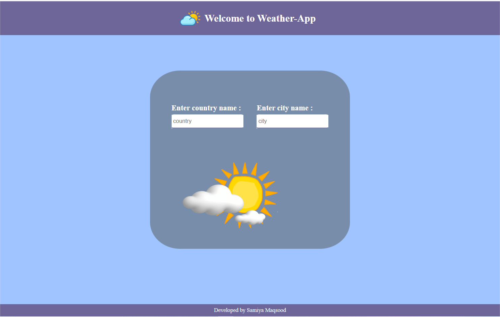
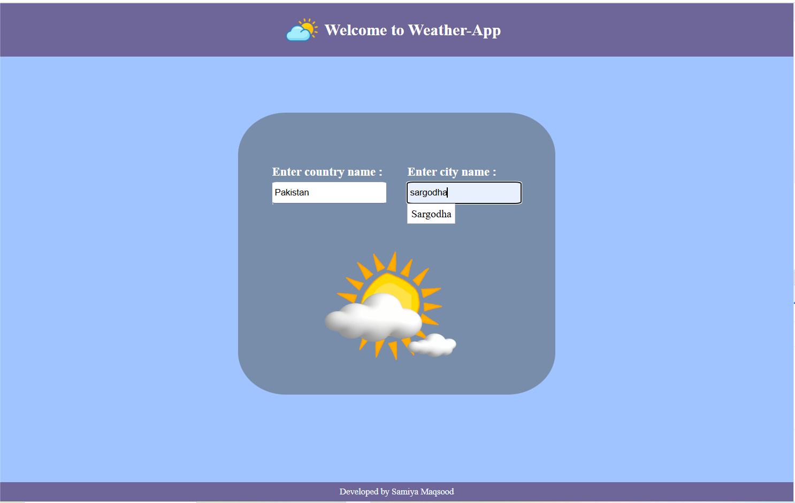
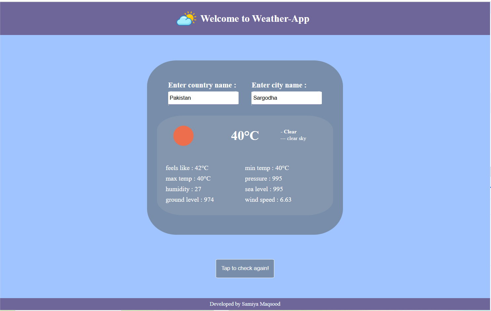

# Weather App

**Weather App** is a responsive, front-end web application that allows users to search for real-time weather information by entering a country and city. It fetches live data from the OpenWeatherMap API, including temperature, weather condition, humidity, wind speed, and pressure. The app includes dynamic auto-suggestions for countries and cities as users type.





---

##  Features

- Real-time weather data from OpenWeatherMap API
- Dynamic country and city suggestions
- Weather condition icons with description
- Responsive layout optimized for desktop and tablet views
- Modular JavaScript with ES6 `import/export`
- Clean user interface with input validation and error handling

---

##  Technologies Used

- HTML5
- CSS3
- JavaScript (ES6)
- OpenWeatherMap API

---

##  Project Structure

```
/project-root
├── index.html              # Main HTML structure
├── style.css               # Stylesheet for layout and UI
├── script.js               # Main logic and API integration
├── country_city_list.js    # Country-to-city mapping for suggestions
├── config.js               # API key (excluded from repo)
├── config.example.js       # Placeholder config for reference
├── .gitignore              # Git ignore rules
├── main_screen.png         # Project screenshot
```

---

## 🚀 Setup Instructions

1. **Clone the repository**:
   ```bash
   git clone https://github.com/your-username/weather-app.git
   cd weather-app
   ```

2. **Install a live server (optional)**:
   ```bash
   npm install -g live-server
   ```

3. **Create `config.js`** with your OpenWeatherMap API key:
   ```js
   // config.js
   export const API_KEY = "YOUR_API_KEY_HERE";
   ```

4. **Run the application**:
   ```bash
   live-server
   ```

---

##  How It Works

- User enters a country and city name.
- Suggestions appear dynamically as the user types.
- On pressing Enter, the app fetches the location's latitude and longitude using OpenWeatherMap's Geocoding API.
- Then, it retrieves and displays the weather data using the Weather API.

---

##  Security

- The API key is stored in a separate `config.js` file and ignored in version control.
- A `config.example.js` is provided for contributors to use as a template.

---

##  Author

**Developed by**: Samiya Maqsood

---

## 📌 License

This project is licensed for educational and personal use. For commercial use or distribution, please seek permission.

---

For questions or contributions, feel free to open an issue or pull request.